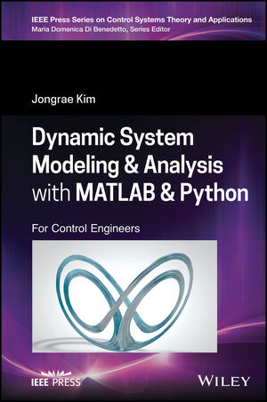

# dynsys.matlab.python

### Dynamic System Modeling &amp; Analysis with MATLAB &amp; Python for Control Engineers
#### Jongrae Kim <myjr52@gmail.com> or <menjkim@leeds.ac.uk>
#### RobustLab: http://robustlab.org



Welcome to the companion website of the book "Dynamic System Modelling & Analysis with MATLAB & Python for Control Engineers" by Jongrae Kim.
The website provides the full MATLAB and Python source codes and the solutions of selected questions in the book.

The book is available in [the Wiley](https://www.wiley.com/en-us/Dynamic+System+Modeling+and+Analysis+with+MATLAB+and+Python%3A+For+Control+Engineers-p-9781119801627), [Amazon USA](https://www.amazon.com/Dynamic-System-Modeling-Analysis-MATLAB/dp/1119801621/ref=sr_1_1?crid=DFAEYC1GJ45D&keywords=Dynamic-System-Modeling-Analysis-MATLAB&qid=1656596714&sprefix=dynamic-system-modeling-analysis-matlab%2Caps%2C132&sr=8-1) or [Amazon UK](https://www.amazon.co.uk/Dynamic-System-Modeling-Analysis-MATLAB/dp/1119801621/ref=sr_1_1?crid=28YLLY9GL6VM2&keywords=Dynamic+System+Modeling+and+Analysis+with+MATLAB+and+Python%3A+For+Control+Engineers&qid=1656596576&sprefix=dynamic+system+modeling+and+analysis+with+matlab+and+python+for+control+engineers%2Caps%2C182&sr=8-1).

Please use the following information to cite the book. 

```
@book{kimjongraedynamicsys2022,
  title={Dynamic System Modeling and Analysis with MATLAB and Python: For Control Engineers},
  author={Kim, Jongrae},
  isbn={9781119801627},
  series={IEEE Press Series on Control Systems Theory and Applications},
  url={https://github.com/myjr52/dynsys.matlab.python},
  year={2022},
  publisher={Wiley-IEEE Press}
}

Kim, Jongrae (2022) Dynamic System Modeling and Analysis with MATLAB and Python: For Control Engineers, Wiley-IEEE Press.
```
Each directory includes
- [**./matlab**](https://github.com/myjr52/dynsys.matlab.python/tree/main/matlab) matab source scripts
- [**./python**](https://github.com/myjr52/dynsys.matlab.python/tree/main/python) python scource scripts
- [**./solution**](https://github.com/myjr52/dynsys.matlab.python/tree/main/solutions) exercise solutions

Solutions for Each Chapter
- [Chapter 1. Introduction](/solutions/Chapter01.md)
- [Chapter 2. Attitude Estimation & Control](/solutions/Chapter02.md)
- [Chapter 3. Autonomous Vehicle Mission Planning](/solutions/Chapter03.md)
- [Chapter 4. Biological System Modelling](/solutions/Chapter04.md)
- [Chapter 5. Biological System Control](/solutions/Chapter05.md)

All Software Licences are:

MIT License

Copyright (c) 2022 Jongrae.K

Permission is hereby granted, free of charge, to any person obtaining a copy
of this software and associated documentation files (the "Software"), to deal
in the Software without restriction, including without limitation the rights
to use, copy, modify, merge, publish, distribute, sublicense, and/or sell
copies of the Software, and to permit persons to whom the Software is
furnished to do so, subject to the following conditions:

The above copyright notice and this permission notice shall be included in all
copies or substantial portions of the Software.

THE SOFTWARE IS PROVIDED "AS IS", WITHOUT WARRANTY OF ANY KIND, EXPRESS OR
IMPLIED, INCLUDING BUT NOT LIMITED TO THE WARRANTIES OF MERCHANTABILITY,
FITNESS FOR A PARTICULAR PURPOSE AND NONINFRINGEMENT. IN NO EVENT SHALL THE
AUTHORS OR COPYRIGHT HOLDERS BE LIABLE FOR ANY CLAIM, DAMAGES OR OTHER
LIABILITY, WHETHER IN AN ACTION OF CONTRACT, TORT OR OTHERWISE, ARISING FROM,
OUT OF OR IN CONNECTION WITH THE SOFTWARE OR THE USE OR OTHER DEALINGS IN THE
SOFTWARE.
