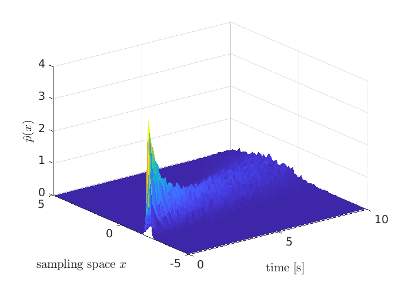
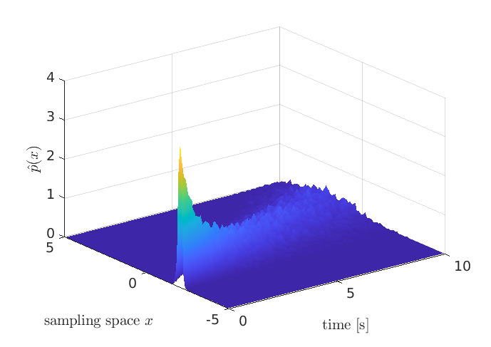
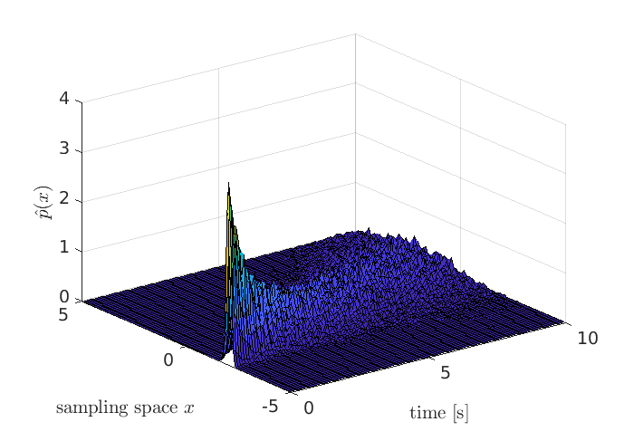
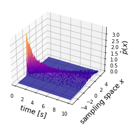
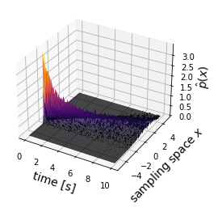
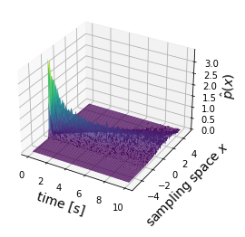

## Chapter 2 Solutions

### Exercise 2.1
Run "matlab_2_2_dqdt_unit_norm_error.m"

### Exercise 2.2
Run "matlab_2_4_stchastic_process.m". Use a large value for the number of realizations, *N_realize*, to make the pdf closer to the truth.
Each plot commands changes the surface plot as follows:

```
>> shading flat
```



```
>> shading interp
```




```
>> shading faceted
```




### Exercise 2.3
Run "python_2_4_stchastic_process.py". 

*rstride* and *cstride* set the number of sampling widths in the row and the column directions of the data, respectively. Values greater than 1 speed up the rendering speed of surface plots. It is useful when plotting big size data.

The following three figures are for (rstride, cstride) equal to (1,1), (10,1) or (1,10), respectively:

=(1,1)")
=(10,1)")
=(1,10)")


All the above figures are drawn with the colormap option set to *magma*.  The colormap settings of the following three figures are *plasma*, *inferno*, and *viridis*, respectively:





### Exercise 2.4
Run "matlab_2_5_gyroscope_simulation.py" or "python_2_5_gyroscope_simulation.py". 

### Exercise 2.5
See the solution chapter of the book

### Exercise 2.6
The matlab solution is "matlab_exercise_2_6.m", and the python solution is "python_exercise_2_6.py".

### Exercies 2.7
The matlab script is as follows:

```
clear;
r1R = [-0.6794 -0.3237 -0.6586]';
r2R = [-0.7296  0.5858  0.3528]';
r3R = [-0.2718  0.6690 -0.6918]';
r4R = [-0.2062 -0.3986 0.8936]';
r5R = [0.6858 -0.7274 -0.0238]';

A1 = blkdiag(r1R',r1R',r1R');
A2 = blkdiag(r2R',r2R',r2R');
A3 = blkdiag(r3R',r3R',r3R');
A4 = blkdiag(r4R',r4R',r4R');
A5 = blkdiag(r5R',r5R',r5R');

A = [A1;A2;A3;A4;A5];

r1B = [-0.2147 -0.7985 0.562]';
r2B = [-0.7658 0.4424 0.4667]';
r3B = [-0.8575 -0.4610 -0.228]';
r4B = [0.4442 0.6863 0.5758]';
r5B = [0.9407 -0.1845 -0.2847]';

rB = [r1B; r2B; r3B; r4B; r5B];

C_BR=(reshape((A'*A)\(A'*rB),3,3))'
```
and the python script is as follows:

```
import numpy as np
from scipy.sparse import block_diag
from scipy.linalg import solve

r1R = np.array([-0.6794, -0.3237, -0.6586]).reshape((3,1))
r2R = np.array([-0.7296,  0.5858,  0.3528]).reshape((3,1))
r3R = np.array([-0.2718,  0.6690, -0.6918]).reshape((3,1))
r4R = np.array([-0.2062, -0.3986, 0.8936]).reshape((3,1))
r5R = np.array([0.6858, -0.7274, -0.0238]).reshape((3,1))


A1 = block_diag((r1R.transpose(),r1R.transpose(),r1R.transpose()))
A2 = block_diag((r2R.transpose(),r2R.transpose(),r2R.transpose()))
A3 = block_diag((r3R.transpose(),r3R.transpose(),r3R.transpose()))
A4 = block_diag((r4R.transpose(),r4R.transpose(),r4R.transpose()))
A5 = block_diag((r5R.transpose(),r5R.transpose(),r5R.transpose()))

A = np.vstack((A1.todense(),A2.todense(),A3.todense(),A4.todense(),A5.todense()))

r1B = np.array([-0.2147, -0.7985, 0.562]).reshape((3,1))
r2B = np.array([-0.7658, 0.4424, 0.4667]).reshape((3,1))
r3B = np.array([-0.8575, -0.4610, -0.228]).reshape((3,1))
r4B = np.array([0.4442, 0.6863, 0.5758]).reshape((3,1))
r5B = np.array([0.9407, -0.1845, -0.2847]).reshape((3,1))

y= np.vstack((r1B,r2B,r3B,r4B,r5B))

vec_C = solve(A.T@A,A.T@y)

C_BR = vec_C.reshape(3,3)
```
### Exercise 2.8
The matlab solution is "matlab_exercise_2_8.m", and the python solution is "python_exercise_2_8.py".

### Exercise 2.9
The matlab solution is "matlab_exercise_2_9.m", and the python solution is "python_exercise_2_9.py".

### Exercise 2.10
The matlab solution is "matlab_2_6_msd_kalman_filter.m",  and the python solution is "python_2_6_msd_kalman_filter.py".

### Exercise 2.11
See [the solution file exercise_2_11_sol.pdf](files/exercise_2_11_sol.pdf), and [matlab_exercise_2_11.m](../matlab/matlab_exercise_2_11.m) or [python_exercise_2_11.py](../python/python_exercise_2_11.py)
