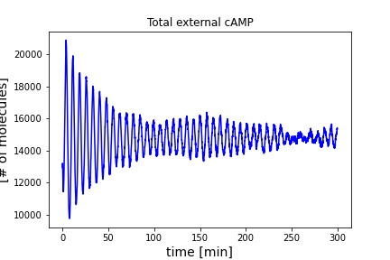

## Chapter 4 Solutions

### Exercise 4.1

See the solution in the book

### Exercise 4.2

See the solution in the book

### Exercise 4.3

See [matlab_4_1_E_Coli_Tryptophan_Pade_approx.m](../matlab/matlab_4_1_E_Coli_Tryptophan_Pade_approx.m) or [python_4_1_E_Coli_Tryptophan_Pade_approx.py](../python/python_4_1_E_Coli_Tryptophan_Pade_approx.py)

The states of the ordinary differential equations (ODEs) describe the concentrations of molecules, which must be greater than or equal to zero. ODE-solvers does not have any functions to force the non-negativeness constraint on the states. In the program of the ODEs, whenever the state and the corresponding time derivative become negative, the time derivative is forced to set to zero. However, this is not enough to keep the state strictly away from the negative values.

[matlab_4_1_E_Coli_Tryptophan_Pade_approx.m](../matlab/matlab_4_1_E_Coli_Tryptophan_Pade_approx.m) or [python_4_1_E_Coli_Tryptophan_Pade_approx.py](../python/python_4_1_E_Coli_Tryptophan_Pade_approx.py) uses an event detection function of the ODE solvers to stop the integral when the states become negative. If the negative event occurs, the corresponding cost function value is set to an arbitrarily large value, e.g., 1000.

### Exercise 4.4

See the solution in the book

### Exercise 4.5

See [python_4_3_E_Coli_opt_est_robustness.py](../python/python_4_3_E_Coli_opt_est_robustness.py)

### Exercise 4.6

See [matlab_4_4_Dicty_ODE.m](../matlab/matlab_4_4_Dicty_ODE.m) or [python_4_4_Dicty_ODE.py](../python/python_4_4_Dicty_ODE.py)

### Exercise 4.7

   > **Set** *p*&delta; in (0,100], e.g. 2, &Delta;*t*, e.g., 0.1 minutes, *t*0, e.g., 600 minutes, *t*f, e.g., 1200 minutes 
   > 
   > **Solve** the minimization problem (4.30) using an optimization algorithm, e.g., the genetic algorithm  
   >
   > **Repeat with** different *p*&delta; in (0,100]

### Exercise 4.8

See [matlab_4_6_Dicty_ODE_robustness.m](../matlab/matlab_4_6_Dicty_ODE_robustness.m) or [python_4_6_Dicty_ODE_robustness.py](../python/python_4_6_Dicty_ODE_robustness.py)

### Exercise 4.9

To extend the model (4.28) for multiple cells, use the approach shown in the following paper:

<em>Stochastic Noise and Synchronisation during Dictyostelium Aggregation Make cAMP Oscillations Robust
Kim J, Heslop-Harrison P, Postlethwaite I, Bates DG (2007) Stochastic Noise and Synchronisation during Dictyostelium Aggregation Make cAMP Oscillations Robust. PLOS Computational Biology 3(11): e218.</em> [https://doi.org/10.1371/journal.pcbi.0030218](https://doi.org/10.1371/journal.pcbi.0030218) 

See [matlab_exercise_4_9.m](../matlab/matlab_exercise_4_9.m) or [python_exercise_4_9.py](../python/python_exercise_4_9.py)

The following figure shows that external cAMP oscillation is enhanced by the synchronization of 20 cells:

